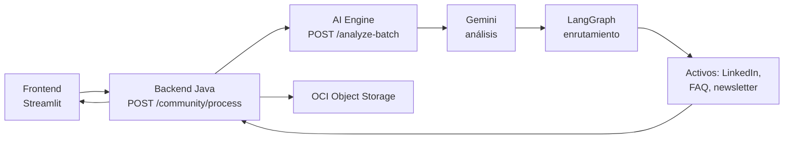

# CommunityLab

## Motor inteligente de transformación y distribución de contenido para comunidades digitales

   
<br>
    

> CommunityLab recibe interacciones de una comunidad digital, las analiza con IA y genera contenido listo para revisar (post de LinkedIn, FAQ y destacado de newsletter), con curaduría humana antes de publicar. Proyecto del equipo 16 de la Hackathon ONE G10 (Oracle Next Education & Alura).

* Última actualización: 8 de octubre de 2026.

## 📑 Tabla de contenidos

<!-- no toc -->
* [Un problema real y con un caso de uso claro](#-un-problema-real-y-con-un-caso-de-uso-claro)
* [Lo que hace CommunityLab](#-lo-que-hace-communitylab)
* [Arquitectura](#-arquitectura)
  * [Pipeline](#pipeline)
  * [Contrato de la API](#contrato-de-la-api)
* [Instalación](#-instalación)
* [Uso](#-uso)
* [Estructura del proyecto](#-estructura-del-proyecto)
* [Roadmap](#-roadmap)
* [Equipo](#-equipo)
* [Licencia](#-licencia)
* [Contribución](#-contribución)

## 🎯 Un problema real y con un caso de uso claro

Las comunidades digitales activas (Discord, Slack, foros) generan a diario testimonios de logros, dudas técnicas recurrentes y proyectos destacados. La mayor parte de ese contenido se pierde en el historial del chat, y los equipos de marketing y gestión de comunidades no tienen tiempo de leer miles de mensajes para encontrar esas historias y convertirlas en contenido publicable.

## 🧩 Lo que hace CommunityLab

Le entregas un lote de interacciones (CSV o JSON, hasta 10 por lote) y CommunityLab:

* **Analiza cada mensaje** → sentimiento, tema, tipo, relevancia e insight, con Gemini.
* **Enruta según el resultado** → logro o testimonio a LinkedIn, pregunta técnica a FAQ, feedback relevante a newsletter, con LangGraph.
* **Genera el activo de contenido** → con el tono de voz del equipo y anonimización de autores a iniciales.
* **Guarda y entrega para curaduría** → una persona aprueba, edita o rechaza antes de publicar.

## 🏗️ Arquitectura

CommunityLab está dividido en tres servicios:

| Capa | Tecnología | Qué hace |
| --- | --- | --- |
| Interfaz | Streamlit | Carga del lote (CSV, JSON o JSON pegado) y visualización de la respuesta |
| Backend | Java · Spring Boot · Spring Data JPA | Valida, persiste, filtra, orquesta y devuelve los activos |
| Motor de IA | Python 3.12 · FastAPI · Uvicorn | Expone `/api/v1/analyze-batch` |
| Análisis | Google Gemini Flash-Lite (GenAI SDK) · Pydantic | Análisis estructurado y validado de cada interacción |
| Enrutamiento | LangGraph · LangChain | Decide qué activo generar según el análisis |
| Base de datos | Oracle Autonomous Database (mTLS con wallet) | Persistencia de interacciones y lotes |
| Almacenamiento | OCI Object Storage | Guarda los activos generados |

### Pipeline



### Contrato de la API

| Endpoint | Propósito | Estado |
| --- | --- | --- |
| `POST /api/v1/community/process` | Procesa un lote y devuelve resumen y activos generados | ✅ Disponible |
| `GET /api/v1/assets/pending` | Lista activos pendientes de curaduría | ⏳ En progreso |
| `PATCH /api/v1/assets/{id}/curate` | Aprueba, edita o rechaza un activo | ⏳ En progreso |

Errores: `400` (cuerpo inválido) y `503` (servicio de IA no disponible). El AI Engine recibe hasta 10 interacciones por lote y conserva el `id` de cada una para trazabilidad.

## 🛠️ Instalación

1. Clona el repositorio:

```bash
git clone https://github.com/No-Country-simulation/G10-LATAM-EQUIPO-16.git
cd G10-LATAM-EQUIPO-16
```

### AI Engine (Python)

1. Crea y activa un entorno virtual:

```bash
cd ai-engine
python -m venv .venv
source .venv/bin/activate        # En Windows: .\.venv\Scripts\Activate.ps1
```

1. Instala las dependencias:

```bash
pip install -r requirements.txt
```

1. Configura tu variable de entorno copiando `.env.example` a `.env`:

   | Variable | Descripción |
   | --- | --- |
   | `GEMINI_API_KEY` | API key de Gemini |

### Backend (Java)

Requiere JDK 21. Copia `.env.example` de la raíz a `.env` y completa:

| Variable | Descripción |
| --- | --- |
| `ORACLE_DB_USER` | Usuario de Oracle Autonomous Database |
| `ORACLE_DB_PASSWORD` | Contraseña del usuario |
| `ORACLE_WALLET_PATH` | Ruta absoluta a la wallet mTLS |
| `ORACLE_DB_URL` | Cadena de conexión JDBC |

> El archivo `.env` contiene credenciales y no se sube al repositorio.

## ▶️ Uso

Levanta cada servicio en su propia terminal:

```bash
# AI Engine (desde ai-engine/)
uvicorn api:app --reload --host 127.0.0.1 --port 8000

# Backend (desde backend/)
./mvnw spring-boot:run

# Frontend (desde frontend/)
streamlit run app.py
```

* AI Engine: `http://127.0.0.1:8000/docs` (documentación interactiva) y `GET /health`.
* Backend: `http://localhost:8080/api/v1/health`.

### Ejemplo: procesar un lote

```json
{
  "origen_comunidad": "Discord_Grupo_ONE_G10",
  "periodo_referencia": "Semana_04",
  "interacciones": [
    {
      "autor": "Lucas Albuquerque",
      "canal": "#dudas-langgraph",
      "tipo": "pregunta_tecnica",
      "texto": "Tengo dudas sobre cómo estructurar los nodos condicionales en LangGraph."
    }
  ]
}
```

La respuesta incluye `resumen_comunidad` (total procesado, sentimiento predominante, temas principales) y `activos_distribucion_generados` (post de LinkedIn, destacado de newsletter, sugerencia de FAQ y datos de almacenamiento en OCI).

## 🗂️ Estructura del proyecto

```text
G10-LATAM-EQUIPO-16/
├── ai-engine/          # Servicio Python: análisis y generación de contenido
├── backend/            # API Java Spring Boot: ingesta, persistencia, orquestación, OCI
├── frontend/           # Interfaz Streamlit
├── workflows/          # Automatización de flujos
├── docs/               # Guía de tono y prompts, dataset de prueba
├── .env.example        # Plantilla de variables de entorno
├── LICENSE
└── README.md
```

> No versionados por seguridad (ver `.gitignore`): `.env` y la wallet de Oracle.

## 🗺️ Roadmap

### Core

* [x] Estructura del backend y conexión a Oracle Autonomous Database
* [x] Entidades, repositorios y endpoint `POST /community/process`
* [x] AI Engine con Gemini, LangGraph y `/analyze-batch`
* [x] Integración Backend → AI Engine → Backend
* [x] MVP del Frontend en Streamlit

### Documentación

* [x] Guía de tono de voz y prompts Few-Shot
* [x] Dataset inicial de prueba

### En progreso

* [ ] Endpoints de curaduría (`/assets/pending` y `/assets/{id}/curate`)
* [ ] Reintentos ante errores temporales de la IA
* [ ] Despliegue del AI Engine en OCI
* [ ] Filtro previo de Data Science

## 👥 Equipo

| Rol | Responsable |
| --- | --- |
| Project Management | Gabriela Correa |
| Backend (Java) | Bryan Naragio, Roberto Borja, Alexandra Estupiñan |
| Backend (Python) | Andrea Jaramillo |
| Machine Learning / prompt engineering | Oscar Cruz |
| Data Science | Saul Mendoza |
| Marketing / copywriting / tono de voz | Uziel Green |
| Frontend | Camilo Moroch |

## 📄 Licencia

Revisa el archivo [LICENSE](LICENSE) para más detalles.

## 🤝 Contribución

Este es un proyecto de equipo. Todo cambio entra por rama y pull request hacia `main`, con revisión de al menos otra persona del equipo. Si encuentras un bug, abre un [issue](https://github.com/No-Country-simulation/G10-LATAM-EQUIPO-16/issues).
